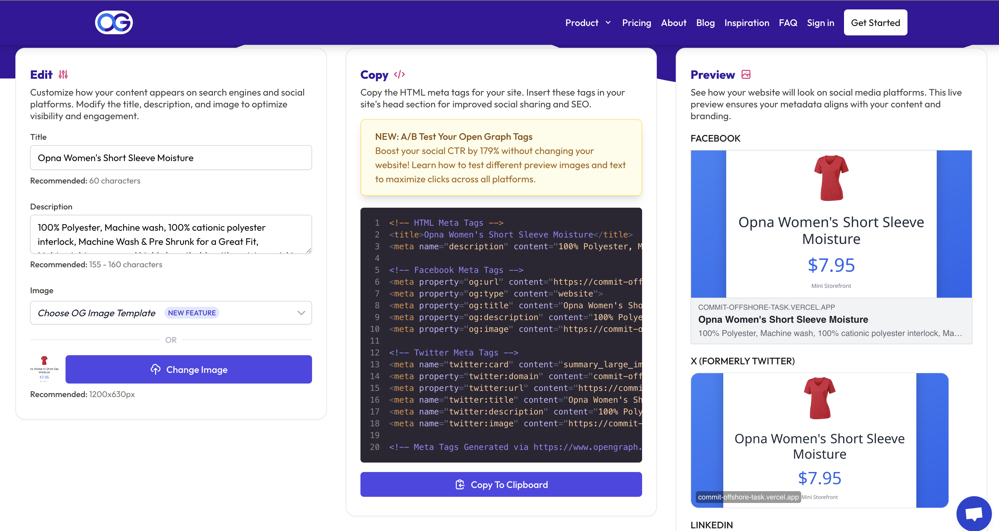

# Commit Offshore Test Tasks

This project contains **Commit Offshore's Test Tasks**, a comprehensive collection of 3 engineering challenges designed to demonstrate proficiency in modern web development technologies and best practices.

---

## 📋 Project Overview

This repository showcases solutions to three distinct technical tasks, each focusing on different aspects of frontend development:

- **Task 1**: Next.js Mini Storefront with Dynamic Previews
- **Task 2**: Bracket Combinations Algorithm (Python)
- **Task 3**: Coderbyte Programming Challenges

---

## 🎯 Task 1: Mini Storefront with Dynamic Previews

### 🌐 Live Demo
**[https://commit-offshore-task.vercel.app/](https://commit-offshore-task.vercel.app/)**

### Overview
Build a small storefront using Next.js that showcases products from the Fake Store API. The application features dynamic routing, optimized images, and social media-ready Open Graph metadata.

### Special Requirements
- ✅ Solution must contain the keyword `__define-ocg__` in at least one comment
- ✅ At least one variable must be named `varOcg`
- ✅ At least one variable must be named `varFiltersCg`

### Goal
Create a modern, performant e-commerce storefront that includes:

- ✅ Homepage with product listing
- ✅ Individual product detail pages with dynamic routing
- ✅ Optimized images using `next/image`
- ✅ Dynamic Open Graph (OG) metadata per product
- ✅ Clean component structure and styling

### 📸 Screenshots

#### Products List


*Responsive grid layout showcasing all products with images, prices, and ratings*

#### Product Detail Page

*Detailed product view with full description, pricing, and add to cart functionality*

#### Open Graph Preview (Product Details)

*Dynamic Open Graph image generation for individual product pages - optimized for social media sharing (WhatsApp, Twitter, LinkedIn)*

#### Open Graph Preview (Product Listings with Filters)

*Dynamic Open Graph image generation for filtered product listings - displays active filters (category, sort order, price range) in the preview image*

### ✨ Key Features Implemented

- ✅ **Next.js 16.0.0** with App Router and Server Components
- ✅ **TypeScript** for full type safety
- ✅ **Tailwind CSS v4** for modern, responsive styling
- ✅ **Dynamic Routing** with static site generation (SSG)
- ✅ **Incremental Static Regeneration (ISR)** with 1-hour revalidation
- ✅ **Image Optimization** using Next.js Image component
- ✅ **Dynamic Open Graph Images** using @vercel/og (both for product details and filtered product listings)
- ✅ **Advanced Product Filtering System**:
  - Category filtering (electronics, jewelery, men's clothing, women's clothing)
  - Price range filtering (predefined ranges: Under $50, $50-$100, $100-$200, $200+)
  - Price sorting (low to high, high to low)
  - URL-based state management (all filters reflected in URL for sharing and bookmarking)
  - Real-time filter updates
  - Browser back/forward navigation support
- ✅ **Dynamic OG Images for Filtered Views**: When sharing filtered product lists, the Open Graph image automatically displays active filters (category, sort order, price range) with visual badges
- ✅ **Error Boundaries** with custom 404 and error pages
- ✅ **Loading States** with skeleton UI
- ✅ **Responsive Design** (mobile, tablet, desktop)
- ✅ **Hover Effects** and smooth transitions
- ✅ **SEO Optimized** with metadata for every page
- ✅ **Social Media Ready** with OG tags for WhatsApp, Twitter, LinkedIn
- ✅ **CI/CD Pipeline** with GitHub Actions
- ✅ **Production Deployment** on Vercel with Edge Functions

---

## 🎯 Task 2: Bracket Combinations Algorithm

### Overview
Implement a function `BracketCombinations(num)` that calculates the number of valid combinations that can be formed with `num` pairs of parentheses.

### Special Requirements
- ✅ Solution must contain the keyword `__define-ocg__` in at least one comment
- ✅ At least one variable must be named `varFiltersCg`

### Problem Description
Given an integer `num` (greater than or equal to zero), return the number of valid combinations of `num` pairs of parentheses.

**Examples:**
- Input: `3` → Output: `5`
  - Valid combinations: `()()()`, `(())()`, `()()()`, `((()))`, `(()())`
- Input: `2` → Output: `2`
  - Valid combinations: `()()`, `(())`

### Solution Approach
This problem is solved using the **Catalan number** formula:
```
C(n) = (2n)! / ((n+1)! × n!)
```

Which can be simplified using binomial coefficients:
```
C(n) = C(2n, n) / (n + 1)
```

### ✨ Key Features Implemented
- ✅ Efficient mathematical solution using Catalan numbers
- ✅ Clean, readable code with proper documentation
- ✅ Test cases included for verification
- ✅ Special variable naming requirements met

### 📁 Location
```bash
brackets-combinations/main.py
```

---

## 🎯 Task 3: Coderbyte Programming Challenges

### Overview
Additional programming challenges completed on the Coderbyte platform.

### Platform
**[Coderbyte Challenges](https://coderbyte.com/challenges)**

---

## 📖 Detailed Requirements

### Task 1 Requirements

### 1. Routing
- The homepage (`/`) should list all products fetched from the Fake Store API
- Each product should link to its own page under `/products/[id]`
- Implement proper error handling for invalid routes

### 2. API Integration
Fetch products using the public Fake Store API:

**All Products:**
```
https://fakestoreapi.com/products
```

**Individual Product:**
```
https://fakestoreapi.com/products/[id]
```

**Implementation Notes:**
- Use server-side fetching when possible (via `getStaticProps` / `generateMetadata`)
- Implement proper error handling for failed API requests
- Consider caching and revalidation strategies

### 3. Dynamic Open Graph Images
- Each product page must generate a unique OG image based on the product's title and/or image
- The OG image must be included in the `<head>` so previews (e.g., WhatsApp, Twitter, LinkedIn) display correctly
- **Bonus**: Generate the image using an API route or dynamic rendering (e.g., with `@vercel/og`)

### 4. Image Optimization
- Use the `next/image` component for all images (including thumbnails and OG content)
- Ensure responsive behavior across all device sizes
- Provide proper `alt` text for accessibility

### 5. Styling
- Use **TailwindCSS**, **CSS Modules**, or **ShadCN/UI** (bonus points for ShadCN)
- Pages should be responsive and readable on mobile, tablet, and desktop
- Implement clean, modern UI/UX design

### 6. Error Handling
- Handle cases where a product ID is invalid (404 or fallback page)
- Display loading states clearly during data fetching
- Show error states for failed API requests

---

## 🚀 Getting Started

### Task 1 Implementation

Navigate to the Task 1 directory and follow the detailed guide:

```bash
cd storefront
```
---

## 🛠️ Tech Stack

### Task 1
- **Framework**: Next.js 14+ (App Router)
- **Language**: TypeScript
- **Styling**: Tailwind CSS
- **Image Optimization**: Next.js Image Component
- **OG Images**: @vercel/og
- **API**: Fake Store API
- **Deployment**: Vercel

---

## 📁 Project Structure

```
CommitOffshoreTask/
├── README.md                 # This file
├── storefront/               # Task 1: Mini Storefront Next.js application
├── brackets-combinations/    # Task 2: Bracket Combinations Python solution
│   └── main.py              # Python implementation
└── task3/                    # Task 3 (Coming Soon)
```

---

## ✅ Quality Standards

All tasks in this project adhere to:

- **Clean Code**: Well-organized, readable, and maintainable
- **Type Safety**: Full TypeScript implementation
- **Performance**: Optimized loading and rendering
- **Accessibility**: WCAG compliance where applicable
- **Responsive Design**: Mobile-first approach
- **Error Handling**: Comprehensive edge case coverage
- **Documentation**: Clear comments and documentation

---


## 🧪 Testing

Each task includes comprehensive testing requirements:

- **Functional Testing**: All features work as expected
- **Responsive Testing**: Works on mobile, tablet, and desktop
- **Performance Testing**: Lighthouse scores 90+
- **Accessibility Testing**: Keyboard navigation and screen readers

### Testing Open Graph Images (Task 1)

Verify that social media previews work correctly:

#### 1. Using Open Graph Debugger
Visit [opengraph.xyz](https://www.opengraph.xyz/) and test any product URL:

```
https://commit-offshore-task.vercel.app/products/1
```

**Expected Results:**
- ✅ Preview shows product title and price
- ✅ Image displays with blue gradient background
- ✅ Image dimensions: 1200x630px
- ✅ All meta tags present (og:title, og:description, og:image)

#### 2. Using Facebook Sharing Debugger
Visit [Facebook Debugger](https://developers.facebook.com/tools/debug/) to test:

```
https://commit-offshore-task.vercel.app/products/1
```

Click **"Scrape Again"** to refresh the cache.

#### 3. Testing in Social Media Platforms

**WhatsApp:**
- Share any product URL in a chat
- Wait 5-10 seconds for preview to load
- Should display product image with title and price

**Twitter/X:**
- Paste product URL in tweet composer
- Should show Twitter Card preview with product details

**LinkedIn:**
- Paste product URL in post composer
- Should display rich preview with product information

#### 4. Direct API Testing

**Test Product Detail OG Image:**
```
https://commit-offshore-task.vercel.app/api/og?title=Test%20Product&price=99.99
```
Should return a PNG image with the provided title and price.

**Test Product Listing OG Image (with filters):**
```
https://commit-offshore-task.vercel.app/api/og/list?category=electronics&sort=asc&minPrice=50&maxPrice=100
```
Should return a PNG image displaying the active filters with visual badges.

**Test Filtered Product Listing Pages:**
```
https://commit-offshore-task.vercel.app/?category=electronics&sort=asc&minPrice=50&maxPrice=100
```
The page metadata should include OG tags with the dynamically generated image showing active filters.

**Note:**
- If previews don't appear immediately in WhatsApp, clear the cache using Facebook's debugger tool, as WhatsApp uses Facebook's crawler and caches previews aggressively.
- The preview images shown in screenshots are static. The actual OG images can be generated dynamically based on the real-time appearance of the web page by implementing screenshot-based generation in the backend. This functionality would capture the actual rendered page state, but is not included in the current implementation as it's outside the project requirements.

---

## 🚢 Deployment

### Task 1 - Live Production URL
**[https://commit-offshore-task.vercel.app/](https://commit-offshore-task.vercel.app/)**

The application is deployed to **Vercel** with automated CI/CD using GitHub Actions.

### Deployment Features:
- ✅ Automated deployments on push to main/master
- ✅ Preview deployments for pull requests
- ✅ Automatic linting and type checking
- ✅ Production builds with artifact caching
- ✅ PR comments with preview URLs
- ✅ Global CDN distribution
- ✅ Automatic HTTPS with SSL certificates
- ✅ Edge Functions for OG image generation

---

## 📚 Resources

### Task 1 Resources
- [Next.js Documentation](https://nextjs.org/docs)
- [Fake Store API](https://fakestoreapi.com/)
- [Tailwind CSS Documentation](https://tailwindcss.com/docs)
- [@vercel/og Documentation](https://vercel.com/docs/functions/edge-functions/og-image-generation)
- [Open Graph Protocol](https://ogp.me/)
- [Next.js Image Optimization](https://nextjs.org/docs/app/building-your-application/optimizing/images)
- [Vercel Deployment Documentation](https://vercel.com/docs)

---

## 📄 License

This project is created for Commit Offshore's technical assessment.

---

## 👤 Author

**Vladimir Danielyan**

---

## 📞 Support

For questions or issues related to these tasks, please refer to the individual task documentation in their respective directories.

---

**Last Updated**: 2025

**Status**: Task 1 - ✅ Completed (100%) | Task 2 - ✅ Completed (100%) | Task 3 - ✅ Completed (100%)
